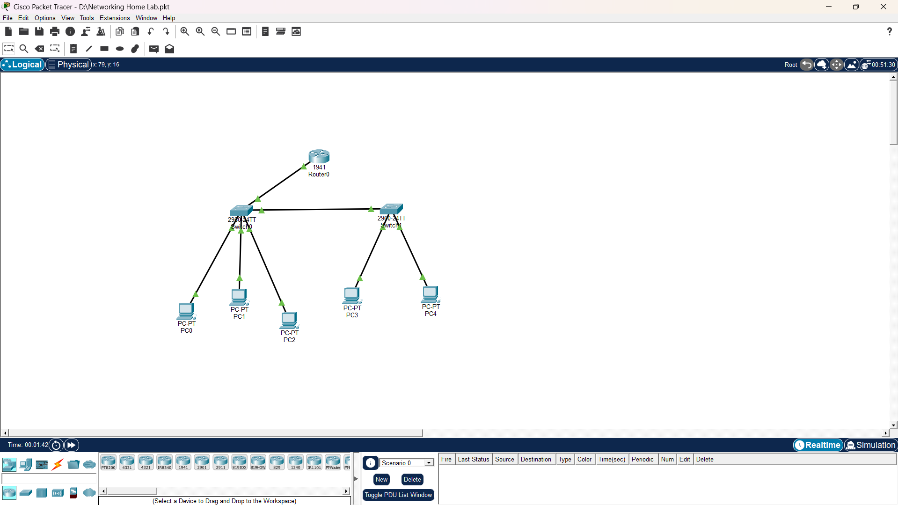

# cisco-networking-homelab
Hands-on Cisco networking lab focused on VLAN configuration using Cisco Packet Tracer.

## Project Overview
This project documents my hands-on networking practice using Cisco Packet Tracer. The lab focuses on configuring and troubleshooting Cisco switches and routers through the Cisco IOS CLI while building a small multi-VLAN network.

## Network Topology
The following topology represents the network used in this lab.

## Technologies & Tools
- Cisco Packet Tracer
- Cisco IOS CLI
- VLANs
- Ethernet Switching
- Trunking
- IP Addressing
- DHCP
- Network Troubleshooting

- ## Network Configuration
### 1. VLAN Configuration
Created and configured VLAN 10 and VLAN 20 on the switch to separate devices into different logical networks.

### 2. Access Port Configuration
Assigned switch access ports to their respective VLANs:
- Fa0/1 → VLAN 10
- Fa0/3 → VLAN 10
- Fa0/2 → VLAN 20

### 3. Trunk Configuration
Configured a switch port as a trunk link to carry traffic from multiple VLANs between network devices.

### 4. IP Addressing
Configured IP addresses, subnet masks, and default gateways for network devices and end devices.

### 5. DHCP Configuration
Configured DHCP to automatically assign IP addresses and other network information to connected end devices.

### 6. Connectivity Testing
Verified network connectivity using Cisco IOS CLI commands and ping tests. Checked VLAN assignments, trunk status, IP addressing, and device connectivity.
